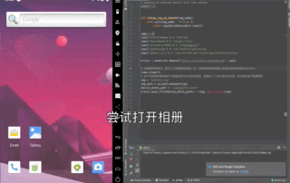

第二期我们将在第一期（给IOS准备点照片）后介绍怎么给安卓手机准备测试照片。当前有很多种类的APP都会去利用处理图片，那当我们测试这类APP的时候，需要解决的问题就是怎么样可以将特定的照片传输到安卓手机，进而使得被测APP可以使用这些照片。

 那你是怎么测试被测APP是否正确处理了用户提供的照片呢？  
 1.就地拍一些照片，然后手动的传输到应用内。  
 2.手动运行被测APP。  
 3.将被被测APP处理后的照片提取出来。  

 上述步骤描述的就是一个手工测试流程，那我们就可以将这些步骤固化，用自动化的方式，给被测APP提供一致的初始照片， 运行特定的功能，接着提取出经过修改的照片。最后我们可以用字节码的方式验证提取出来的照片是否和手工测试流程提取出来的照片是否一致，进而验证我们的APP功能始终是正常的。

 在这篇文章中，我们将专注于怎么将图片传输到我们的安卓手机上。幸运的是，我们可以使用同IOS一样的指令“pushFile”。在底层，“pushFile”会调用一系列的ADB指定现将图片传出到手机上，然后在通过广播的方式告知手机系统刷新媒体库。现在安卓厂商很多，并且不同的安卓厂商生产的系统可能会将图片存放在不同的路径上，所以我们必须要知道被测手机存放图片的位置。因为模拟器和一部分真实的手机设备是将图片存储在/mnt/sdcard/Pictures。  
 下面是将图片上传到安卓手机上的一个示例：
 ```java
 // 下面代码的意思是将存储在本地路径/path/to/photo/locally下的myPhoto.jpg传输到设备的/mnt/sdcard/Pictures下并将其命名为myPhoto.jpg
 driver.pushFile("/mnt/sdcard/Pictures/myPhoto.jpg", "/path/to/photo/locally/myPhoto.jpg"); 
 ``` 
 第一个参数"/mnt/sdcard/Pictures/myPhoto.jpg"表示我们存储在手机上的路径已经名字，正如我们上面所说，不同的手机这个地址可能是不同的，所以你需要根据手机官方的文档去获取到正确的地址。  
 第二个参数就是你上传的图片的本地路径。
 当这条命令执行之后，Appium将会把图片编码成String发送到Appium的服务端，之后服务端将数据发送到手机上。这种实现方式可以保证不管你是在本地运行还是在云端运行"pushFile”都可以正确的将图片发送到指定的手机上。
 下面给出一个完整的示例，这这个示例中，我们对手机自带的Google Photos App进行测试。首先是创建正确的capabilities：
 ```java
 DesiredCapabilities capabilities = new DesiredCapabilities();
 capabilities.setCapability("platformName", "Android");
 capabilities.setCapability("deviceName", "Android Emulator");
 capabilities.setCapability("automationName", "UiAutomator2");
 capabilities.setCapability("appPackage", "com.google.android.apps.photos");
 capabilities.setCapability("appActivity", ".home.HomeActivity");
 ```

 ```java
  // 打开APP.
 AndroidDriver driver = new AndroidDriver<>(new URL("http://localhost:4723/wd/hub"), capabilities);
 ```
 当APP打开后，我们会被导航到一些UI页面上，然后就是一些展示内容，大致上就是Google想让我们使用它们的云服务。当然了我们现在是机器人，也不关心Google的云服务，所以我在代码中定义了一些定位符，和一些删除已有照片的逻辑，从而使得后续的验证工作简单点。
 ```java
 private static By backupSwitch = By.id("com.google.android.apps.photos:id/auto_backup_switch");
 private static By touchOutside = By.id("com.google.android.apps.photos:id/touch_outside");
 private static By keepOff = By.xpath("//*[@text='KEEP OFF']");
 private static By photo = By.xpath("//android.view.ViewGroup[contains(@content-desc, 'Photo taken')]");
 private static By trash = By.id("com.google.android.apps.photos:id/trash");
 private static By moveToTrash = By.xpath("//*[@text='MOVE TO TRASH']");

 public void setupAppState(AndroidDriver driver) {
    // 处理一些无用的UI界面
    WebDriverWait wait = new WebDriverWait(driver, 10);
    WebDriverWait shortWait = new WebDriverWait(driver, 3);
    wait.until(ExpectedConditions.presenceOfElementLocated(backupSwitch)).click();
    wait.until(ExpectedConditions.presenceOfElementLocated(touchOutside)).click();
    wait.until(ExpectedConditions.presenceOfElementLocated(keepOff)).click();

    // 利用死循环删除所有的照片，当找不到图片时退出循环
    try {
        while (true) {
            shortWait.until(ExpectedConditions.presenceOfElementLocated(photo)).click();
            shortWait.until(ExpectedConditions.presenceOfElementLocated(trash)).click();
            shortWait.until(ExpectedConditions.presenceOfElementLocated(moveToTrash)).click();
        }
    } catch (TimeoutException ignore) {}
 }
 ```

 现在我们就可以开始测试了。
 ```java
 setupAppState(driver);

 // 设置我们想要上传到安卓设备的照片信息
 File assetDir = new File(classpathRoot, "../assets");
 File img = new File(assetDir.getCanonicalPath(), "cloudgrey.png");

 // 开始上传图片
 driver.pushFile(ANDROID_PHOTO_PATH + "/" + img.getName(), img);

 // 等待设备获取到新的照片，然后点用WebDriverWait验证照片已经存在
 WebDriverWait wait = new WebDriverWait(driver, 10);
 ExpectedCondition condition = ExpectedConditions.numberOfElementsToBe(photo,1);
 wait.until(condition);
 ```


 观察上述代码，我们可以发现实现图片上传的关键，就是很简单的调用了“pushFile”。这里最后的验证其实不是很完善，因为我们只是简单的验证了图片是否存在。那在真实的测试场景下，我们需要将图片提取出来做更完善的验证工作。

 那将上述的所有片段代码合在一起，如下：
 ```java
 import io.appium.java_client.android.AndroidDriver;
 import java.io.File;
 import java.io.IOException;
 import java.net.URL;
 import org.junit.Test;
 import org.openqa.selenium.By;
 import org.openqa.selenium.TimeoutException;
 import org.openqa.selenium.remote.DesiredCapabilities;
 import org.openqa.selenium.support.ui.ExpectedCondition;
 import org.openqa.selenium.support.ui.ExpectedConditions;
 import org.openqa.selenium.support.ui.WebDriverWait;

 // 为了能正确运行以下的测试，Appium中的the appium-android-driver包的版本必须要大于等于1.38,因为它修复了一些相关的bug

 public class Edition002_Android_Photos {

    private static String ANDROID_PHOTO_PATH = "/mnt/sdcard/Pictures";

    private static By backupSwitch = By.id("com.google.android.apps.photos:id/auto_backup_switch");
    private static By touchOutside = By.id("com.google.android.apps.photos:id/touch_outside");
    private static By keepOff = By.xpath("//*[@text='KEEP OFF']");
    private static By photo = By.xpath("//android.view.ViewGroup[contains(@content-desc, 'Photo taken')]");
    private static By trash = By.id("com.google.android.apps.photos:id/trash");
    private static By moveToTrash = By.xpath("//*[@text='MOVE TO TRASH']");

    @Test
    public void testSeedPhotoPicker() throws IOException {
        DesiredCapabilities capabilities = new DesiredCapabilities();

        File classpathRoot = new File(System.getProperty("user.dir"));

        capabilities.setCapability("platformName", "Android");
        capabilities.setCapability("deviceName", "Android Emulator");
        capabilities.setCapability("automationName", "UiAutomator2");
        capabilities.setCapability("appPackage", "com.google.android.apps.photos");
        capabilities.setCapability("appActivity", ".home.HomeActivity");

        // Open the app.
        AndroidDriver driver = new AndroidDriver<>(new URL("http://localhost:4723/wd/hub"), capabilities);

        try {
            // 在进入照片夹的前面会有一些无关的UI界面，需要先处理以确保当前是在照片夹的界面
            setupAppState(driver);

             // 设置我们想要上传到安卓设备的照片信息
            File assetDir = new File(classpathRoot, "../assets");
            File img = new File(assetDir.getCanonicalPath(), "cloudgrey.png");

            // 开始上传图片
            driver.pushFile(ANDROID_PHOTO_PATH + "/" + img.getName(), img);

             // 等待设备获取到新的照片，然后点用WebDriverWait验证照片已经存在
            WebDriverWait wait = new WebDriverWait(driver, 10);
            ExpectedCondition condition = ExpectedConditions.numberOfElementsToBe(photo,1);
            wait.until(condition);
        } finally {
            driver.quit();
        }
    }

    public void setupAppState(AndroidDriver driver) {
        // 处理一些无用的UI界面
        WebDriverWait wait = new WebDriverWait(driver, 10);
        WebDriverWait shortWait = new WebDriverWait(driver, 3);
        wait.until(ExpectedConditions.presenceOfElementLocated(backupSwitch)).click();
        wait.until(ExpectedConditions.presenceOfElementLocated(touchOutside)).click();
        wait.until(ExpectedConditions.presenceOfElementLocated(keepOff)).click();

        // 利用死循环删除所有的照片，当找不到图片时退出循环
        try {
            while (true) {
                shortWait.until(ExpectedConditions.presenceOfElementLocated(photo)).click();
                shortWait.until(ExpectedConditions.presenceOfElementLocated(trash)).click();
                shortWait.until(ExpectedConditions.presenceOfElementLocated(moveToTrash)).click();
            }
        } catch (TimeoutException ignore) {}
    }
 }

 ```

 最后我再补上一份Python代码，并附上图片。
 ```python
import os
import time

from appium import webdriver


def change_img_as_base64(img_name):
    with open(img_name, 'rb') as f:
        return base64.b64encode(f.read())

caps = {}
caps['platformName'] = 'Android'
caps['deviceName'] = 'Google Pixel'
caps['automationName'] = 'UiAutomator2'
caps['appPackage'] = 'com.android.gallery3d'
caps['appActivity'] = 'com.android.gallery3d.app.GalleryActivity'

driver = webdriver.Remote("http://localhost:4723/wd/hub", caps)

# 这里我死等待5s，是为了让效果更加明显一点，因为刚开始的时候它会弹出当前没有照片的toast
time.sleep(5)
# 由于我选择的模拟器打开相册应用不会有其他界面，直接进入了显示照片的界面，所以我这里不需要操作
img = 'Android.jpg'
img_path = os.path.abspath(img)
device_photo_path = '/sdcard/Pictures'
driver.push_file(device_photo_path+'/'+img, source_path=img)
 ```
 

