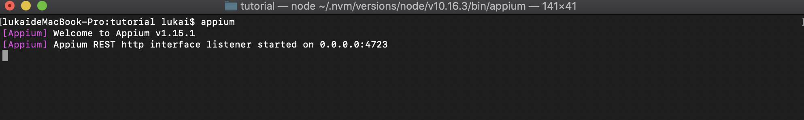
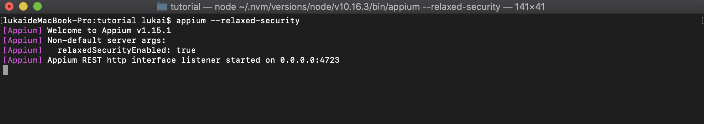
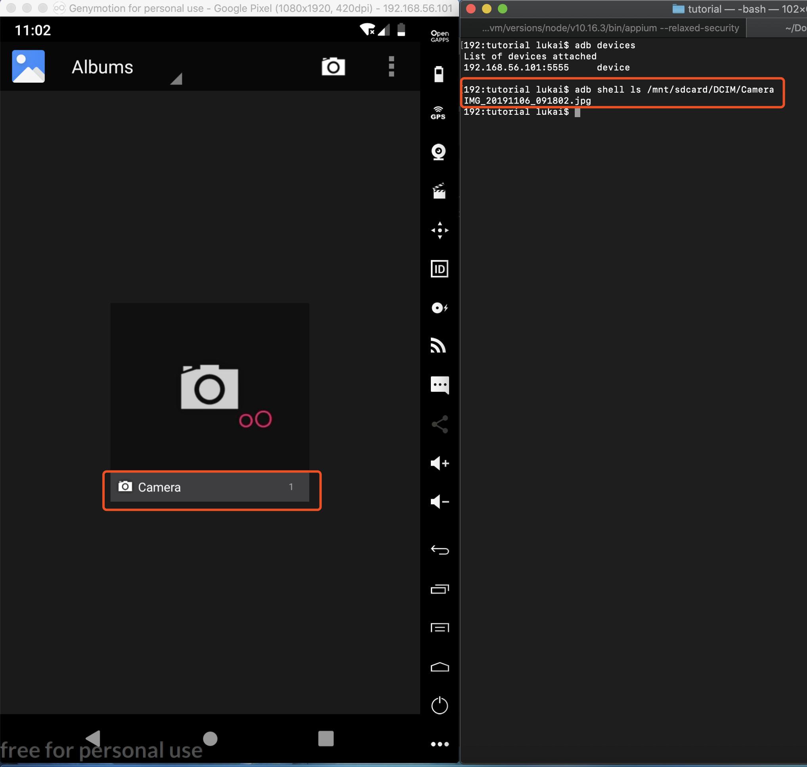
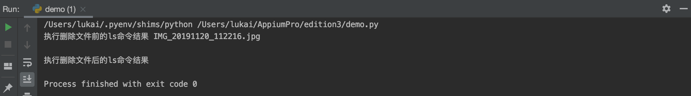

# 第三期-通过Appium运行任意的ADB命令
在上一期的专栏中，我们讨论了[如果将图片传输到安卓设备的媒体库中](https://appiumpro.com/editions/2)。在最后的示例代码中，我们演示了上传图片到安卓设备，当然啦这功能肯定是正常的，但是会发现在设置测试前置条件的时候，我们是通过UI操作的方式将当前媒体库中存在的照片删除，这难免会显得有点笨拙。那Appium有更好的方式去做这件事情吗？答案是肯定有的。  
大部分安卓轻度使用者可能会不知道[ADB](https://developer.android.com/studio/command-line/adb.html)（Android Debug Bridge）是什么。ADB是Google提供的Android SDK中的一个强有力的工具，它可以在已经连接的模拟器或者真机设备上运行各种有趣的指令。其中一个指令就是`adb shell`，它可以有权限访问设备的文件系统（包括模拟器只有root权限的文件系统和root过的真机设备）。所以在解决我们上文说的测试前置条件准备的时候，我们可以通过`adb shell`使用`rm`达到在测试前删除SD卡中的所有照片。  
在很长的一段时间，Appium是不允许使用ADB指令的。这是因为Appium的设计初衷是想Appium服务端运行在远程环境上，那这就有可能会与一些其它服务或者其他的Appium服务共享操作系统，然后这个操作系统上大可能的连接了很多的安卓设备。如果允许Appium的客户端执行所有的ADB功能的话，会造成比较大的安全漏洞。但是近期，Appium的团队决定使用一个特殊的标志位来开启这样功能，所以Appium的服务端就可以特意开启这样功能了（举个例子，比如事先已经明确了自己团队可以使用这个server）。  
在Appium 1.7.2这个版本中， 我们可以通过`--relaxed-security`这个标志来开启执行ADB指定的功能，如下：  
```
appium --relaxed-security
```


可以明显观察到当appium启动的时候添加了`--relaxed-security`命令行输出多了一个用于明确指示功能开启的语句。`[Appium]   relaxedSecurityEnabled: true`这就表示当前appium支持了执行ADB命令的功能。

当Appium处于这种模式的时候，我们将可以使用一个新的"mobile"命令，叫做"mobile:shell"。Appium可以通过`executeScript `来执行这个特殊的"mobile"命令，Java示例如下:
```java
driver.executeScript("mobile: shell", <arg>);
```
`args` 是必须要有两个键的JSONifiable对象，这两个键分别如下
1.command：String类型，表示要在adb shell下执行的命令
2.args: 一个String类型的数组，数组内的值是需要传令给shell命令的参数
以我们的目的举例，我们需要删除SD卡中的照片，在我们的设备上这个路径是`/mnt/sdcard/Pictures`。如果我们不通过Appium来使用ADB命令的话，我们可以直接运行以下命令:
```
adb shell rm -rf /mnt/sdcard/Pictures/*.*
```
下面我们来将这条命令转换成Appium的"mobile:shell"命令。
首先将开头的`adb shell`去掉，会剩下如下部分，如下：
```
rm -rf /mnt/sdcard/Pictures/*.*
```
那第一个部分`rm`就对应的是"command",后续剩下的就是"args"。于是乎就有了
```java
List<String> removePicsArgs = Arrays.asList(
  "-rf",
  "/mnt/sdcard/Pictures/*.*"
);
Map<String, Object> removePicsCmd = ImmutableMap.of(
  "command", "rm",
  "args", removePicsArgs
);
driver.executeScript("mobile: shell", removePicsCmd);
```
实际上，我们创建的对象用Json表示的话就像这样：
```
{"command": "rm", "args": ["-rf", "/mnt/sdcard/Pictures/*.*"]}
```
当然我们也可以获取到调用ADB命令后的结果，举一个例子，比如我们想验证，当前目录是否为空:
```java
List<String> lsArgs = Arrays.asList("/mnt/sdcard/Pictures/*.*");
Map<String, Object> lsCmd = ImmutableMap.of(
"command", "ls",
"args", lsArgs
);
String lsOutput = (String) driver.executeScript("mobile: shell", lsCmd);
```
这样命令执行后的结果就会保存到lsOutput这个String变量中，我们可以对结果做我们想要做的处理，类似于验证结果。现在我们将上面两个操作结合在一起，通过Appium写一个比较完整的测试用例。当然了，上文描述的这两种操作在一些其他的场景下可能会十分有用，就比如上一期测试前置环境的准备工作。代码如下：
```java
import com.google.common.collect.ImmutableMap;
import io.appium.java_client.android.AndroidDriver;
import java.net.MalformedURLException;
import java.net.URL;
import java.util.Arrays;
import java.util.List;
import java.util.Map;
import org.junit.Assert;
import org.junit.Test;
import org.openqa.selenium.remote.DesiredCapabilities;

public class Edition003_Arbitrary_ADB {

private static String ANDROID_PHOTO_PATH = "/mnt/sdcard/Pictures";

@Test
public void testArbitraryADBCommands() throws MalformedURLException {
  DesiredCapabilities capabilities = new DesiredCapabilities();
  capabilities.setCapability("platformName", "Android");
  capabilities.setCapability("deviceName", "Android Emulator");
  capabilities.setCapability("automationName", "UiAutomator2");
  capabilities.setCapability("appPackage", "com.google.android.apps.photos");
  capabilities.setCapability("appActivity", ".home.HomeActivity");

  // Open the app.
  AndroidDriver driver = new AndroidDriver<>(new URL("http://localhost:4723/wd/hub"), capabilities);

  try {
    List<String> removePicsArgs = Arrays.asList("-rf", ANDROID_PHOTO_PATH + "/*.*");
    Map<String, Object> removePicsCmd = ImmutableMap
      .of("command", "rm", "args", removePicsArgs);
    driver.executeScript("mobile: shell", removePicsCmd);

    List<String> lsArgs = Arrays.asList("/mnt/sdcard");
    Map<String, Object> lsCmd = ImmutableMap.of("command", "ls", "args", lsArgs);
    String lsOutput = (String) driver.executeScript("mobile: shell", lsCmd);
    Assert.assertEquals("", lsOutput);
  } finally {
    driver.quit();
  }
  }
}

```
这里我再补充一份python代码，实现同样的功能。
先描述下测试环境，我这边开启了一个安卓模拟器，并且使用照相机拍了一张照片，这个模拟器照片存储的路径是'/mnt/sdcard/DCIM/Camera'，我们可以不通过Appium执行ADB shell命令来验证一下。结果显示如下:



python代码如下：

```python
from appium import webdriver

caps = {}
caps['platformName'] = 'Android'
caps['deviceName'] = 'Google Pixel'
caps['automationName'] = 'UiAutomator2'
caps['appPackage'] = 'com.android.launcher3'
caps['appActivity'] = 'com.android.launcher3.Launcher'

driver = webdriver.Remote("http://localhost:4723/wd/hub", caps)

camera_path = '/mnt/sdcard/DCIM/Camera'
rm_camera_command = {
    'command': 'rm',
    'args': ['-rf', '/mnt/sdcard/DCIM/Camera/*.*']
}
ls_camera_command = {
    'command': 'ls',
    'args': ['/mnt/sdcard/DCIM/Camera']
}
ls_output_before_rm = driver.execute_script('mobile:shell', ls_camera_command)
driver.execute_script('mobile:shell', rm_camera_command)
ls_output_after_rm = driver.execute_script('mobile:shell', ls_camera_command)
print("执行删除文件前的ls命令结果", ls_output_before_rm)
print("执行删除文件后的ls命令结果", ls_output_after_rm)
```
执行结果如下：


在这篇专栏中，我们通过几个简单的文件系统的操作指令见识到了ADB的强大能力。除了使用ADB删除文锦啊，我们还可以做很多其他有用的操作，有趣的操作。最后，你可以在[GitHub](https://github.com/cloudgrey-io/appiumpro/blob/master/java/src/test/java/Edition003_Arbitrary_ADB.java)上找到本文出现的代码。


